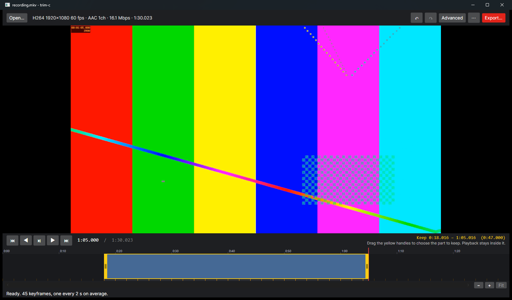
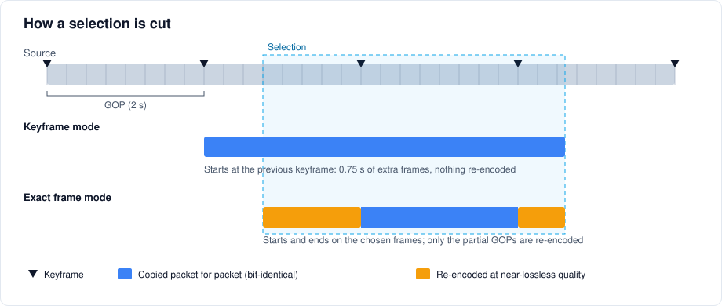
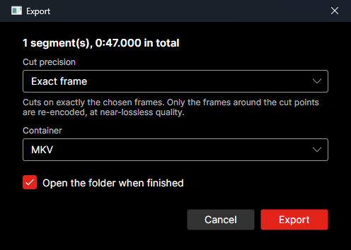
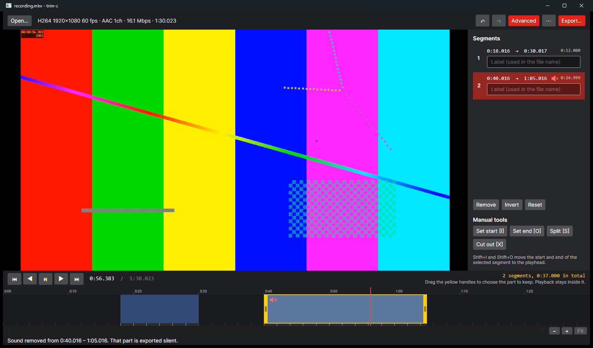
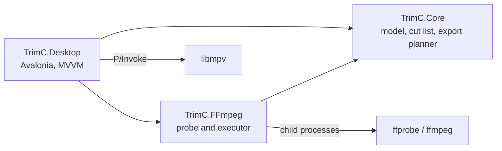

🇬🇧 English | 🇹🇷 [Türkçe](README.tr.md)

# trim-c

[](https://github.com/toprakgureli/trim-c/actions/workflows/ci.yml)


[](LICENSE)

A desktop video trimmer that cuts recordings without losing quality. It either copies the original packets untouched, or, when a cut must land on an exact frame, re-encodes only the few frames around each cut point.



## Why I built this

Screen recordings made at high quality with tools such as OBS easily reach around 70 Mbps. When I trimmed recordings like these with common tools, the result came out far worse than the source. Cutting a nine-second clip with the trim feature of Windows Photos produced a 2.7 Mbps file, and exporting it from CapCut produced 15 to 20 Mbps. These tools re-encode the whole clip, even though cutting does not require it.

trim-c does the opposite. The packets the recorder wrote are copied into the new file as they are, so the output has the same bit rate and the same picture as the source, and a cut of any length takes seconds.

## What it does

- Opens a recording with the whole video selected. Dragging the two yellow handles on the timeline trims it, the way the Movies & TV app does, and the preview follows the handle frame by frame.
- Keeps manual tools for finer work in the **Advanced** panel: marking parts to keep or cut out with the keyboard, splitting, inverting and a segment list.
- Zooms the timeline down to single frames with Ctrl+wheel, and moves around a zoomed view with a scroll bar.
- Removes the sound of a clip from its right-click menu, both in the preview and in the export.
- Undoes and redoes every edit with Ctrl+Z and Ctrl+Y (or Ctrl+Shift+Z).
- Exports each part as its own file, or joins them into one file, in MP4, MKV or MOV, wherever you choose in the standard Windows save dialog, and opens that folder when it is done.
- Appears in the Windows "Open with" menu for common video formats.
- Has an English and a Turkish interface.
- Offers two cut precisions:
  - **Keyframe**: fully lossless and instant. A cut can start up to one GOP (typically 1 to 2 seconds) earlier than the selection.
  - **Exact frame** (the default): starts and ends on exactly the chosen frames, the way film and broadcast editors cut. Only the partial GOPs at the two ends of a segment are re-encoded; everything between them is still copied.

## How it works



A video stream is a series of GOPs (groups of pictures). Each GOP begins with a keyframe that can be decoded on its own; the frames after it only store changes relative to earlier frames. Copying can therefore only start on a keyframe.

In **keyframe mode** trim-c moves the start of each segment to a keyframe (the previous one by default, so nothing you selected is lost) and copies the packets with `ffmpeg -c copy`. No frame is decoded or encoded.

In **exact frame mode** each segment is split into three parts:

1. From the selected start to the next keyframe: re-encoded with x264 or x265 at near-lossless quality (CRF 12 and 14), using the profile and pixel format of the source.
2. From that keyframe to the last keyframe in the segment: copied packet for packet. The copy is limited by the exact packet count of each GOP rather than by time, so with B-frames no frame from the next GOP leaks in.
3. From the last keyframe to the selected end: re-encoded like the first part.

The audio of the segment is copied as a single continuous part, so the joints between the video parts never touch the audio. Every part keeps its original timestamps, shifted onto the output timeline, and the parts are joined byte by byte as MPEG transport streams. However long a segment is, at most two partial GOPs are re-encoded: about 4 seconds of video with a two-second GOP.

## Measured results

On a 90-second 1080p60 H.264 test recording with a two-second GOP:

| Export | Video bit rate | Frames |
|---|---|---|
| Source | 16.42 Mbps | 5400 |
| Keyframe mode, 0:06 to 0:18 | 16.36 Mbps | 722 (720 plus 2 B-frame references) |
| Keyframe mode, 0:38 to 0:52.333 | 16.43 Mbps | 862 |
| Exact frame mode, two cuts removed and merged | – | 4396, exactly as selected |

The exact frame export has no gap between consecutive video frames or audio packets, and it decodes without errors. On an OBS recording encoded with AMD AMF, where the x264-encoded edges are joined to the AMF-encoded copy, a merge of two exact-frame segments also produced exactly the selected number of frames.

## Install

1. Download `trim-c-<version>-win-x64.zip` from the [latest release](https://github.com/toprakgureli/trim-c/releases/latest).
2. Extract it to any folder.
3. Run `trim-c.exe`.

Nothing else is needed. The package contains the .NET runtime, FFmpeg and libmpv, and it does not need administrator rights. It runs on 64-bit Windows 10 and 11.

On start, trim-c adds itself to the "Open with" menu of video files for the current user only (under `HKEY_CURRENT_USER\Software\Classes`). It never changes which program opens a format by default. The entry is refreshed on every start, so it follows the folder if you move trim-c. To remove trim-c, clear **⋯ → Show in “Open with” for video files**, then delete the folder.

Settings are stored in `%LOCALAPPDATA%\trim-c\settings.json` and logs in `%LOCALAPPDATA%\trim-c\logs`. If something goes wrong, the status bar shows the error and the log file holds the details.

### Building from source

Building needs the [.NET 10 SDK](https://dotnet.microsoft.com/download/dotnet/10.0). `build/package.ps1` produces the same package as a release: it publishes a self-contained build and adds FFmpeg and libmpv, pinned to exact versions and verified by SHA-256.

```powershell
git clone https://github.com/toprakgureli/trim-c.git
cd trim-c
./build/package.ps1
```

The archive is written to `artifacts/`. For development, `dotnet run --project src/TrimC.Desktop` starts the application. Use FFmpeg 9 or newer: exact frame mode is verified with the FFmpeg 9 build the package ships, and FFmpeg 6.1 produces wrong frame counts in it. The application finds FFmpeg next to the executable, in an `ffmpeg` folder beside it, or on the `PATH`, and libmpv (`libmpv-2.dll`) next to the executable.

Set `TRIMC_SKIP_SHELL_INTEGRATION=1` to keep a development build from registering itself in the "Open with" menu.

The code builds on Linux and macOS as well, but the video preview embeds mpv into a native window, which is only verified on Windows.

## Usage

1. Open a recording with **Open…**, Ctrl+O, by dropping it on the window, or by right-clicking a video in Explorer and choosing **Open with → trim-c**.
2. Drag the yellow handles on the timeline to the first and the last frame you want to keep. The preview shows the frame under the handle and the summary above the timeline shows the kept range. Arrow keys step one frame at a time if you want to check a frame before dropping a handle there.

   Preview stays inside the part you keep, so what you watch is what you export. Play starts from the first kept frame, playback stops on the last one, and clicking outside the selection lands on its nearest edge. With several segments, playback skips the parts that are cut out. The limits follow the handles, undo and redo as you edit. Opening **Advanced** lifts them, because the manual tools need the whole file.
3. Press **Export…** or Ctrl+E. The export window asks for the cut precision and the container, and remembers your choices for next time.

   

4. The standard Windows save dialog then asks where to save and under what name. It opens in the folder of your last export, or next to the source the first time, and suggests a name that contains the exported range, for example `recording-00.00.18.016-00.01.05.016.mkv`. Choosing another file type, or typing `.mp4`, `.mkv` or `.mov` at the end of the name, changes the container.

When the export finishes, the folder opens with the new file selected. If you pick an existing file and confirm that it may be replaced, the new file is written next to it first and replaces it only once the export has succeeded. When every segment becomes a file of its own, the name you choose is their common prefix, each file adds its range or label, and no existing file is replaced.

### Advanced tools

**Advanced** in the top bar opens a side panel for keeping several parts of one recording. It lists the segments, lets you label, remove, invert or reset them, and holds the manual tools:

- Press **I** on the first frame to keep and **O** on the last one to close a segment. Repeat for every part you want.
- To work the other way round, press **I** on the first frame to remove, move to the first frame to keep and press **X**. The frames in between are cut out and everything else is kept.
- **S** splits the segment under the playhead, and each part gets its own handles.

Right-clicking a clip on the timeline opens its menu. **Remove sound** (or **M**) mutes the clip: it is drawn with a crossed-out speaker, the preview plays it silent, and the export leaves its audio out. A muted clip exported on its own has no audio track. Merged with clips that keep their sound, it carries silence in the codec of the source instead, so the joined file keeps one continuous audio track. **Restore sound** brings it back, and both are undone with Ctrl+Z like any other edit.



The **⋯** menu holds the language (system, English or Turkish, applied on the next start), the "Open with" entry and a shortcut to the log folder.

| Key | Action |
|---|---|
| Space | Play or pause |
| Left / Right | Previous / next frame |
| Ctrl+Left / Ctrl+Right | Previous / next keyframe |
| Ctrl+Z | Undo |
| Ctrl+Y / Ctrl+Shift+Z | Redo |
| I | Set the start mark |
| O | Close a segment at the playhead |
| X | Cut out the frames between the start mark and the playhead |
| Shift+I / Shift+O | Move the start / end of the selected segment to the playhead |
| S | Split the segment under the playhead |
| M | Remove or restore the sound of the selected segment |
| Delete | Remove the selected segment |
| Ctrl+= / Ctrl+- | Zoom the timeline in / out |
| Ctrl+0 | Show the whole video on the timeline |
| Ctrl+O | Open a file |
| Ctrl+E | Export |
| Esc | Cancel a running export |

On the timeline, drag a yellow handle to trim and click or drag anywhere else to seek. Ctrl+wheel zooms around the pointer, down to a quarter of a second across the whole width. The wheel, the scroll bar under the timeline and dragging with the middle mouse button move a zoomed view, and the **−**, **+** and **Fit** buttons next to the scroll bar zoom around the playhead. Orange ticks are keyframes, and the dimmed areas are left out of the export.

## Architecture



| Project | Responsibility |
|---|---|
| `TrimC.Core` | Media model, keyframe index with per-GOP packet counts, cut list with undo history, export planning. No I/O, no UI, no FFmpeg. |
| `TrimC.FFmpeg` | Reads media and keyframes with ffprobe and runs export plans with ffmpeg. |
| `TrimC.Desktop` | The Avalonia application: timeline control, libmpv preview, view models, settings, localization and the "Open with" registration. |

Exporting is split into planning and execution. `ExportPlanner` turns segments and options into an `ExportPlan`, a list of tool-independent steps (copy a range, encode a range, join parts). `FFmpegExportExecutor` turns each step into an ffmpeg command. Because planning is pure, every decision about keyframes, offsets, stream selection and file names is covered by unit tests that run without FFmpeg.

## Development

```sh
dotnet build trim-c.slnx
dotnet test --solution trim-c.slnx
dotnet format trim-c.slnx --verify-no-changes
```

The integration tests generate a clip with B-frames and run real exports through ffmpeg, checking frame counts, keyframe placement and gaps on the timeline. They run when FFmpeg is on the `PATH` or `TRIMC_FFMPEG_DIR` points to it, and are skipped otherwise. The "Open with" tests write to a scratch registry key, so they only run in CI or when `TRIMC_RUN_REGISTRY_TESTS` is set. CI runs everything on Windows and Linux.

The code follows the [dotnet/runtime coding style](https://github.com/dotnet/runtime/blob/main/docs/coding-guidelines/coding-style.md), and `.editorconfig` is derived from the one in dotnet/runtime. Public APIs follow the [Framework Design Guidelines](https://learn.microsoft.com/dotnet/standard/design-guidelines/). The rules are enforced at build time: `AnalysisLevel` is `latest-all`, code style is checked during the build and warnings are errors.

## Limitations

- Exact frame mode supports H.264 and HEVC video. Other codecs can be cut in keyframe mode.
- In exact frame mode, transport stream parts carry only video and audio, so subtitle and data streams are left out.
- In keyframe mode, the end of a cut can include one or two extra frames when the video has B-frames, because those frames are needed to decode the last selected ones.
- Merging muted and audible clips encodes the silence in the codec of the source. AAC, Opus, MP3, AC-3, E-AC-3, FLAC, Vorbis, ALAC and PCM audio are supported. With any other codec, export the clips as separate files.

## License

[MIT](LICENSE).
