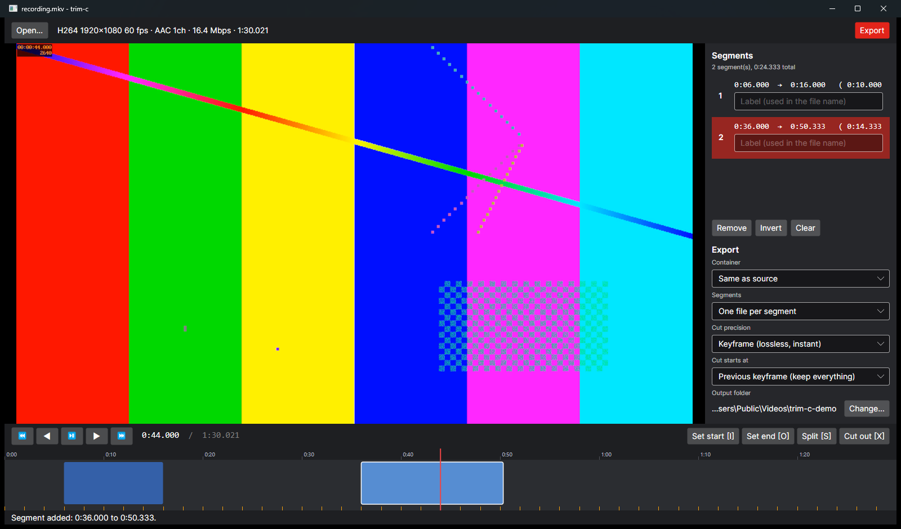
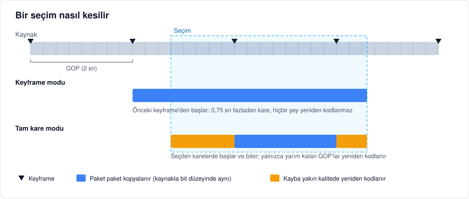
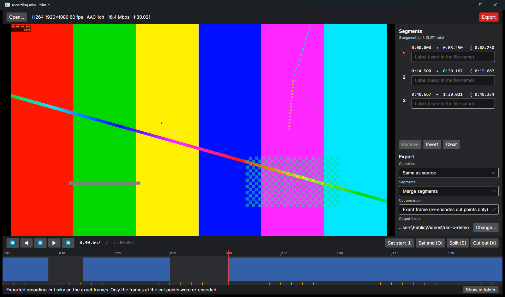
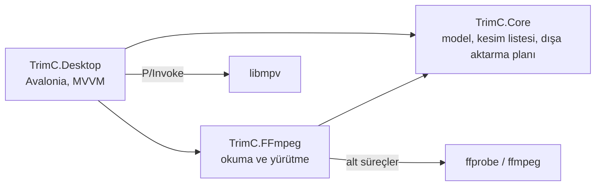

🇹🇷 Türkçe | 🇬🇧 [English](README.md)

# trim-c

[](https://github.com/toprakgureli/trim-c/actions/workflows/ci.yml)


[](LICENSE)

Kayıtları kalite kaybı olmadan kesen bir masaüstü video kesme aracı. Ya orijinal paketleri hiç dokunmadan kopyalar ya da kesimin tam bir karede olması gerekiyorsa yalnızca kesim noktalarının çevresindeki birkaç kareyi yeniden kodlar.



## Neden geliştirdim?

OBS gibi araçlarla yüksek kalitede alınan ekran kayıtları 70 Mbps civarına kolayca çıkıyor. Bu tür kayıtları yaygın araçlarla kestiğimde sonuç kaynaktan çok daha kötü oluyordu. Dokuz saniyelik bir klibi Windows Fotoğraflar'ın kırpma özelliğiyle kestiğimde 2,7 Mbps'lik, CapCut'tan dışa aktardığımda 15–20 Mbps'lik bir dosya elde ettim. Bu araçlar kesmek için gerekmediği hâlde klibin tamamını yeniden kodluyor.

trim-c bunun tersini yapıyor. Kayıt programının yazdığı paketler yeni dosyaya olduğu gibi kopyalanıyor. Çıkan dosyanın bitrate'i ve görüntüsü kaynakla aynı kalıyor, kesim ne kadar uzun olursa olsun birkaç saniyede bitiyor.

## Ne yapar?

- Kaydı açar, keyframe'lerini okur ve yakınlaştırılabilen bir zaman çizelgesinde gösterir.
- Saklanacak ya da çıkarılacak bölümleri klavyeyle kare kare işaretlemeni sağlar.
- Her bölümü ayrı bir dosya olarak dışa aktarır ya da hepsini tek dosyada birleştirir. MP4, MKV ve MOV desteklenir.
- İki kesim hassasiyeti sunar:
  - **Keyframe:** Tamamen kayıpsızdır ve anında biter. Kesim, seçimden en fazla bir GOP (genellikle 1–2 saniye) önce başlayabilir.
  - **Tam kare:** Film ve televizyon kurgusundaki gibi tam olarak seçilen karelerde başlar ve biter. Yalnızca segmentin iki ucundaki yarım GOP'lar yeniden kodlanır, aradaki her şey yine kopyalanır.

## Nasıl çalışır?



Bir video akışı GOP (group of pictures) denen kare gruplarından oluşur. Her GOP, tek başına çözülebilen bir anahtar kareyle (keyframe) başlar. Ondan sonraki kareler yalnızca önceki karelere göre değişen kısmı saklar. Bu yüzden kopyalama ancak bir keyframe'den başlayabilir.

**Keyframe modunda** trim-c her segmentin başlangıcını bir keyframe'e kaydırır ve paketleri `ffmpeg -c copy` ile kopyalar. Varsayılan olarak önceki keyframe seçilir, böylece seçtiğin hiçbir kare kaybolmaz. Hiçbir kare çözülmez ya da kodlanmaz.

**Tam kare modunda** her segment üç parçaya ayrılır:

1. Seçilen başlangıçtan bir sonraki keyframe'e kadar olan kısım, kaynağın profili ve piksel formatıyla x264 ya da x265 kullanılarak kayba yakın kalitede (CRF 12 ve 14) yeniden kodlanır.
2. O keyframe'den segmentteki son keyframe'e kadar olan kısım paket paket kopyalanır. Kopya süreyle değil, her GOP'un tam paket sayısıyla sınırlanır. Böylece B-frame'li videolarda sonraki GOP'tan hiçbir kare araya karışmaz.
3. Son keyframe'den seçilen bitişe kadar olan kısım, ilk parça gibi yeniden kodlanır.

Segmentin sesi tek ve kesintisiz bir parça olarak kopyalanır, bu yüzden video parçalarının birleştiği noktalar sese hiç dokunmaz. Her parça kaynaktaki zaman damgalarını korur, yalnızca çıkış zaman çizelgesine kaydırılır. Parçalar MPEG transport stream olarak bayt düzeyinde birleştirilir. Segment ne kadar uzun olursa olsun en fazla iki yarım GOP yeniden kodlanır. İki saniyelik GOP'ta bu, yaklaşık 4 saniyelik video demektir.

## Ölçülen sonuçlar

İki saniyelik GOP'a sahip, 90 saniyelik 1080p60 H.264 bir test kaydında:

| Dışa aktarma | Video bitrate'i | Kare sayısı |
|---|---|---|
| Kaynak | 16,42 Mbps | 5400 |
| Keyframe modu, 0:06–0:18 | 16,36 Mbps | 722 (720 ve 2 B-frame referansı) |
| Keyframe modu, 0:38–0:52,333 | 16,43 Mbps | 862 |
| Tam kare modu, iki aralık çıkarılıp birleştirildi | – | 4396, seçimle birebir aynı |

Tam kare modunda alınan çıktıda ardışık video kareleri ve ses paketleri arasında boşluk yok, dosya hatasız çözülüyor. AMD AMF ile kodlanmış bir OBS kaydında da, yani x264 ile kodlanan uçlar AMF ile kodlanmış kopyayla birleştiğinde, iki tam kare segmentin birleştirilmesi seçilen kare sayısını birebir verdi.



## Kurulum

1. [Son sürümden](https://github.com/toprakgureli/trim-c/releases/latest) `trim-c-<sürüm>-win-x64.zip` dosyasını indir.
2. İstediğin bir klasöre çıkar.
3. `trim-c.exe` dosyasını çalıştır.

Başka hiçbir şey gerekmez. Paket .NET çalışma ortamını, FFmpeg'i ve libmpv'yi içerir. Kayıt defterine bir şey yazmaz, yönetici izni de istemez. 64 bit Windows 10 ve 11'de çalışır. Kaldırmak için klasörü silmen yeterli.

Günlük dosyaları `%LOCALAPPDATA%\trim-c\logs` klasörüne yazılır. Bir sorun çıkarsa durum çubuğu hatayı gösterir, ayrıntılar günlük dosyasında bulunur.

### Kaynaktan derleme

Derlemek için [.NET 10 SDK](https://dotnet.microsoft.com/download/dotnet/10.0) gerekir. `build/package.ps1`, sürümlerdeki paketin aynısını üretir. Kendi içinde çalışan bir derleme yayımlar, FFmpeg ile libmpv'yi kesin sürümlerine sabitlenmiş ve SHA-256 ile doğrulanmış olarak ekler.

```powershell
git clone https://github.com/toprakgureli/trim-c.git
cd trim-c
./build/package.ps1
```

Arşiv `artifacts/` klasörüne yazılır. Geliştirme sırasında uygulamayı `dotnet run --project src/TrimC.Desktop` ile başlatabilirsin. FFmpeg 9 veya üzerini kullan. Tam kare modu, paketle gelen FFmpeg 9 derlemesiyle doğrulandı, FFmpeg 6.1 ise bu modda yanlış kare sayıları üretiyor. Uygulama FFmpeg'i çalıştırılabilir dosyanın yanında, yanındaki `ffmpeg` klasöründe ya da `PATH` üzerinde, libmpv'yi (`libmpv-2.dll`) ise çalıştırılabilir dosyanın yanında arar.

Kod Linux ve macOS'te de derleniyor ancak video önizlemesi mpv'yi yerel bir pencereye yerleştirdiği için yalnızca Windows'ta doğrulandı.

## Kullanım

1. Kaydı **Open…** düğmesiyle, Ctrl+O ile, pencereye sürükleyip bırakarak ya da `trim-c.exe <dosya>` komutuyla aç. Son yöntem, Windows'taki "Birlikte aç" menüsünün de çalışmasını sağlar.
2. Saklamak istediğin ilk kareye git ve **I** tuşuna bas, sonra bitişe git ve **O** tuşuna bas. Saklamak istediğin her bölüm için bunu tekrarla.
3. Tersinden çalışmak istersen çıkarılacak ilk karede **I** tuşuna bas, saklanacak ilk kareye git ve **X** tuşuna bas. Aradaki kareler çıkarılır, geri kalan her şey saklanır.
4. Kapsayıcıyı, segmentlerin ayrı mı yoksa birleştirilmiş mi aktarılacağını ve kesim hassasiyetini seç, ardından **Export** düğmesine ya da Ctrl+E'ye bas.

Başka bir klasör seçmediğin sürece dosyalar kaynağın yanına yazılır. Dosya adlarında dışa aktarılan aralık (örneğin `recording-00.00.06.000-00.00.18.000.mkv`) ya da segmente yazdığın etiket yer alır. Var olan dosyaların üzerine hiçbir zaman yazılmaz.

| Tuş | İşlev |
|---|---|
| Boşluk | Oynat ya da duraklat |
| Sol / Sağ ok | Önceki / sonraki kare |
| Ctrl+Sol / Ctrl+Sağ | Önceki / sonraki keyframe |
| I | Başlangıç işaretini koy |
| O | Oynatma imlecinde segmenti kapat |
| X | Başlangıç işaretiyle oynatma imleci arasındaki kareleri çıkar |
| Shift+I / Shift+O | Seçili segmentin başını / sonunu oynatma imlecine taşı |
| S | İmlecin altındaki segmenti ikiye böl |
| Delete | Seçili segmenti sil |
| Ctrl+O | Dosya aç |
| Ctrl+E | Dışa aktar |
| Esc | Süren dışa aktarmayı iptal et |

Zaman çizelgesinde tıklayarak ya da sürükleyerek konuma git, tekerlekle kaydır, Ctrl+tekerlekle yakınlaştır. Turuncu çizgiler keyframe'leri gösterir.

## Mimari



| Proje | Sorumluluk |
|---|---|
| `TrimC.Core` | Medya modeli, GOP başına paket sayısını da tutan keyframe dizini, kesim listesi ve dışa aktarma planı. G/Ç yok, arayüz yok, FFmpeg yok. |
| `TrimC.FFmpeg` | Medyayı ve keyframe'leri ffprobe ile okur, dışa aktarma planlarını ffmpeg ile çalıştırır. |
| `TrimC.Desktop` | Avalonia uygulaması: zaman çizelgesi kontrolü, libmpv önizlemesi ve view model'ler. |

Dışa aktarma, planlama ve yürütme olarak ikiye ayrılır. `ExportPlanner` segmentleri ve seçenekleri bir `ExportPlan`'e, yani araçtan bağımsız adımlardan oluşan bir listeye (aralık kopyala, aralık kodla, parçaları birleştir) dönüştürür. `FFmpegExportExecutor` her adımı bir ffmpeg komutuna çevirir. Planlama yan etkisiz olduğu için keyframe, zaman kaydırma, akış seçimi ve dosya adlarıyla ilgili her karar FFmpeg olmadan çalışan birim testleriyle güvence altında.

## Geliştirme

```sh
dotnet build trim-c.slnx
dotnet test --solution trim-c.slnx
dotnet format trim-c.slnx --verify-no-changes
```

Entegrasyon testleri B-frame içeren bir klip üretir ve ffmpeg ile gerçek dışa aktarmalar yapar. Kare sayılarını, keyframe konumlarını ve zaman çizelgesindeki boşlukları kontrol eder. FFmpeg `PATH`'teyse ya da `TRIMC_FFMPEG_DIR` onu gösteriyorsa çalışır, değilse atlanır. CI her şeyi Windows ve Linux'ta çalıştırır.

Kod, [dotnet/runtime kod stiline](https://github.com/dotnet/runtime/blob/main/docs/coding-guidelines/coding-style.md) uyar. `.editorconfig` dosyası dotnet/runtime'daki dosyadan türetildi. Public API'ler [Framework Design Guidelines](https://learn.microsoft.com/dotnet/standard/design-guidelines/) kurallarını izler. Kurallar derleme sırasında zorunlu tutulur. `AnalysisLevel` değeri `latest-all` olarak ayarlıdır, kod stili derlemede denetlenir ve uyarılar hata sayılır.

## Sınırlamalar

- Tam kare modu H.264 ve HEVC videoyu destekler. Diğer kodekler keyframe modunda kesilebilir.
- Tam kare modunda transport stream parçaları yalnızca video ve ses taşır, bu yüzden altyazı ve veri akışları dışarıda kalır.
- Keyframe modunda, video B-frame içeriyorsa kesimin sonuna bir iki kare fazladan girebilir. Bu kareler, seçilen son karelerin çözülebilmesi için gereklidir.
- Arayüz İngilizcedir.

## Lisans

[MIT](LICENSE).
